# Mini proyecto Sistemas Operativos

**Universidad ICESI**  
**Curso:** Sistemas Operativos  
**Docente:** Daniel Barragán C.  
**Tema:**  LXC/LXD Containers  


**Código:** A00054120  
**Nombre:** Laura Isabella Tabares

**Código:** A000569092  
**Nombre:** Estiven Landázury  

**Código:** A00242068  
**Nombre:** Angie Lorena Pérez 

**Repositorio GitHub:** https://github.com/estivenLandazury/so-project/tree/so-project  


## Objetivos

Conocer las caracteristicas principales de la virtualización por medio de contenedores LXC/LXD
Virtualizar servicios empleando contenedores LXC/LXD
Realizar configuraciones sobre sistemas operativos para el acceso a servicios (network, load balancing)


## Aproviosionamiento básico de máquina virtual: se instala el sistema operativo Ubuntu 16.04.4, se configura las interfaces de red, y se asignan 4 núcleos.

* La instalación de Ubuntu 16.04 que se encuentra en: http://releases.ubuntu.com/16.04/ se realiza sobre la herramienta VirtualBox.  

Con la siguiente configuración en los núcleos:


y la siguiente configuración de red:
  

Que terminará con un proceso exitoso en la instalación y configuración.  

**NOTA:** no olvides instalar ssh y activar el servidor.


## Instalación de LXC/LXD con permisos para el usuario operativos.

* Después de completar la instalación del sistema operativo ubuntu y crear el usuario de operativos.

 


Se ejecuta el comando: para instalar hypervisor LXD.

```Console  
$ sudo apt install lxd lxd-client
```

Hypervisor LXD es un administrador de contenedores de linux. Complemento que facilita el uso de contenedores por medio de comandos simples.  

* Tambien se instala el paquete de bridge-utils que contiene una utilidad necesaria para crear y administrar interfaces bridge. Para instalar este paquete se corre el siguiente comando:

```Console
$ sudo apt-get install bridge-utils
```

* Finalmente se instala **zfsutils-linux** que sirve para administrar los contenedores. Este paquete se instala con el siguiente comando.

```Console
$ sudo apt-get install zfsutils-linux
```
Ahora se agrega el usuario operativos al grupo de sudoers para que permita usar sudo al usuario operativos. LXC viene instalado previamente en Ubuntu.  
```
usermod -aG sudo operativos   
```  
Después se agrega el  usuario operativos al grupo lxd, luego se reloguea a la sesion operativos para que se actualize el grupo.  
```
sudo usermod --append --groups lxd operativos
``` 

### ¿Qué es un storage pool?

El **storage pool** (grupo de almacenamiento) es un conjunto de discos en un entorno de almacenamiento compartido, y que trabajen como un solo para el sistema. Las agrupaciones de almacenamiento pueden configurarse en diferentes tamaños y proporcionar una serie de beneficios, que incluyen mejoras de rendimiento, administración y proteccion de datos. Las agrupaciones pueden aprovisionarse para incluir cualquier cantidad de capacidad y utilizar cualquier combinación de espacio de almacenamiento físico en una red de area de almacenamiento(SAN). En entornos de servidor virtual, las máquinas virtuales (VM) se pueden almacenar en grupos dedicados, lo que garantiza que las máquinas virtuales críticas tengan acceso a la cantidad adecuada de almacenamiento[1].


### ¿Qué es ZFS y cuáles son sus ventajas?

**ZFS** es un sistema de archivos y administrador de volúmenes lógicos, construido por Sun Microsystems. para dirigir y controlar la ubicación, el almacenamiento y la recuperación de datos en sistemas informáticos. ZFS usa un esquema de direccionamiento de 128 bits y puede almacenar hasta 275 mil millones de TB por grupo de almacenamiento.

Algunas de las características mas relevantes son:

 * Integridad de los datos: ZFS está diseñado con un enfoque en la integridad de los datos. Es decir, está diseñado para proteger los datos en el disco contra la corrupción de datos silenciosos causada por podredumbre de bits, picos actuales, errores en el firmware del disco, escrituras fantasmas, lecturas / escrituras mal dirigidas, errores de paridad de memoria entre la matriz y la memoria del servidor, errores del controlador y sobrescribe accidentalmente. ZFS garantiza que los datos siempre sean coherentes en el disco utilizando una serie de técnicas, incluida la copia sobre escritura. Lo que esto significa es que cuando se cambian los datos, no se sobrescribe; siempre se escribe en un nuevo bloque y se suma la suma de comprobación antes de que los punteros a los datos se cambien. Los datos antiguos pueden conservarse, creando instantáneas de los datos a lo largo del tiempo a medida que se realizan los cambios. Las escrituras de archivos que usan ZFS son transaccionales: todo o nada está escrito en el disco.
Esta característica permite que los archivos se mantengan correctamente, siendo capaz de detectar datos o archivos corruptos y arreglarlos automaticamente, esto se logra a través de un modelo transaccional.

  * Depuración: ZFS puede programarse para realizar un "scrub" sobre todos los datos en un pool de almacenamiento, verificando cada dato con su suma de comprobación correspondiente para verificar su integridad, detectar cualquier corrupción de datos silenciosos y corregir cualquier error donde sea posible.
Cuando los datos se almacenan de forma redundante, en una matriz espejada o de tipo RAID, se pueden autorreparar automáticamente y sin intervención del administrador. Dado que se registran daños en los datos, ZFS puede sacar a la luz los defectos en los módulos de memoria (u otro hardware) que hacen que los datos se almacenen en los discos duros de forma incorrecta.

La depuración tiene una prioridad baja de E / S, por lo que tiene un efecto mínimo en el rendimiento del sistema y puede funcionar mientras se usa el grupo de almacenamiento.

  * Snapshots: Son copias del sistema de archivo de fácil creación, permitiendo hacer respaldo de la información o copias de seguridad de forma casi inmediata, con la característica de que son sólo de lectura.

  * Clones: También se pueden crear instantáneas grabables ("clones"), lo que da como resultado dos sistemas de archivos independientes que comparten un conjunto de bloques. A medida que se realizan cambios en cualquiera de los sistemas de archivos clonados, se crean nuevos bloques de datos para reflejar esos cambios, pero todos los bloques sin cambios se continúan compartiendo, sin importar cuántos clones existan. Esto es posible debido al diseño de copiado sobre escritura.

  * Envío y recepción de Snapshots:Los Snapshots de los sistemas de archivos ZFS y los volúmenes se pueden enviar a hosts remotos a través de la red. Esta secuencia de datos puede ser un sistema de archivos completo o un volumen, o puede ser los cambios desde la última vez que se envió. Al enviar solo los cambios, el tamaño del flujo depende del número de bloques cambiados entre las instantáneas. Esto proporciona una estrategia muy eficiente para sincronizar copias de seguridad.[2]

* Para la configuración del puente LXD (LXD bridge configuration), por medio del cual, los contenedores se van a comunicar con el host y posteriormente con la internet. Se procede a ejecutar el siguiente comando.

```
$ sudo lxd init
```

Con el cual se configura la inicialización de los contenedores, como se puede ver en las siguientes imágenes.  

PASO 1 e indicar **SI**:
   
 PASO 2 se selecciona el nombre de la interfaz:    
   
 PASO 3 se indica **SI** para proveer la IPV4 para la conexión con otra redes:    
   
 PASO 4 se asigna la siguiente dirección IPV4:    
   
 PASO 5: se provee el numero de mascar de red, para delimitar el ambito de red:  
   
 PASO 6 se provee el primer DHCP que permite configurar la red de manera dinámica, es decir sin una intervencón especial:    
     
 PASO 7 se provee el último DHCP:  
     
 PASO 8 se provee el número de clientes para el  DHCP:     
    
 PASO 9 se slecciona que si se desea NAT para el protocolo IPV4 para el intercambio de paquetes entre redes:      
   
 PASO 10 el protocolo de IPV6 no se selecciona:        
   
 Finalmente se puede observar en la imagen siguiente que se ha configurado exitosamente el contenedor:  
     
 
## Creación de contenedores con servicio web (dos contenedores web)
* Para crear los contenedores web ejecutamos los siguientes comandos:

Para el servidor1:
```Console
$ lxc launch ubuntu:16.04 server1
```
Para el servidor2:  

```Console  
$ lxc launch ubuntu:16.04 server2
```
Y para el balanceador de cargas:  

```Console  
$ lxc launch ubuntu:16.04 balancelanda
```
Luego podremos verlo con el comando:  

```Console
$ lxc list
```  
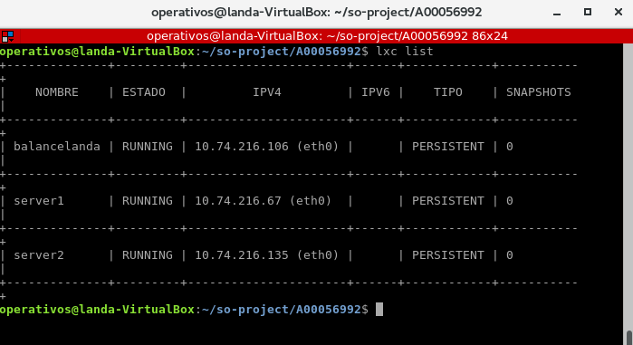

* Al ser la primera vez que se crea un contenedor en la máquina, el comando también descarga una imagen de ubuntu 16.04, que puede ser utilizada como plantilla para otros contenedores.

Una vez creados los contenedoresweb se ingresa a cada uno de estos para configurar el servidor ingresando al shell del servidor con el siguiente comando:

```Console  
$ lxc exec server1 -- /bin/bash  
```

Y allí se instala **Nginx** para relizar la configuración.

``` $ sudo apt-get update ```
```$ sudo apt-get install nginx```

Al terminar la configuraciòn de los dos servidores web (con los tres comandos anteriores), usamos el siguiente comando:

```Console  
sudo vi /var/www/html/index.nginx-debian.html  
```
Para editar el nombre del servidor e indentificarlos más fácil.

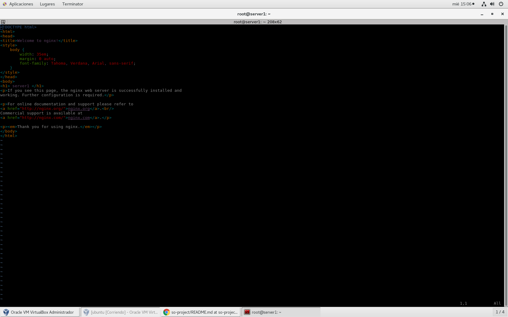
 
Y de la misma forma el archivo para el server2. Se cambia el contenido para diferenciarlos. (ej: en vez de server1, server2)

Para cumplir con la asignación de un procesador único para cada servicio web, se ejecutan los siguientes comandos:

Para el server1:  

```   
$ lxc config set server1 limits.cpu 1  
```

Para el server2:  

```  
$ lxc config set server2 limits.cpu 1   
```


## Balanceador de carga  

En el punto anterior se creó el balanceador de cargas con nombre **balancelanda** que se puede evidenciar en la imagen del comando lxc list.  

Luego, se accede a este por medio del Shell para configurarlo, con el comando:

```
$ lxc exec balancelanda  
```

Aquí también se debe instalar Nginx y se configura como balanceador de carga editando el archivo

```$ sudo nano /etc/nginx/conf.d/balanceLanda.conf```


En este archivo se escribe el siguiente contenido

```  
 Define which servers to include in the load balancing scheme. 
# It's best to use the servers' private IPs for better performance and security.
# You can find the private IPs at your UpCloud Control Panel Network section.

upstream backend {
   least_conn;
   server 10.74.216.67; 
   server 10.74.216.135;
}

# This server accepts all traffic to port 80 and passes it to the upstream. 
# Notice that the upstream name and the proxy_pass need to match.

server {
   listen 80; 

   location / {
      proxy_pass http://backend;
   }
}

```

Lo que se configuro aquí fue el bloque de servidores a los cuales llegaran las peticiones. Con el método **least_conn** se balancea la carga para los dos servidores.

* Luego, debemos eliminar la carpeta que aloja sitios web, para que, cuando lleguen las solicitudes al balanceador no retorne la pagina html, sino que pasen a los servidores. 

```$ sudo rm /etc/nginx/sites-enabled/default```


Adicionalmente el servicio nginx se debe reiniciar, asi el balanceador funcionara correctamente.


```$ sudo service nginx restart```


**Configuración del balanceador para recibir conexiones remotas:** Para esto se debe alterar la iptable, que es la que permite el intercambio de tráfico entre el http del host y el balanceador de carga.

```sudo iptables -t nat -A PREROUTING -p tcp -m conntrack --ctstate NEW --dport 80 -j DNAT --to-destination 10.74.216.106:80```


**Validación del servicio para conexión remota y el balanceador están activos**

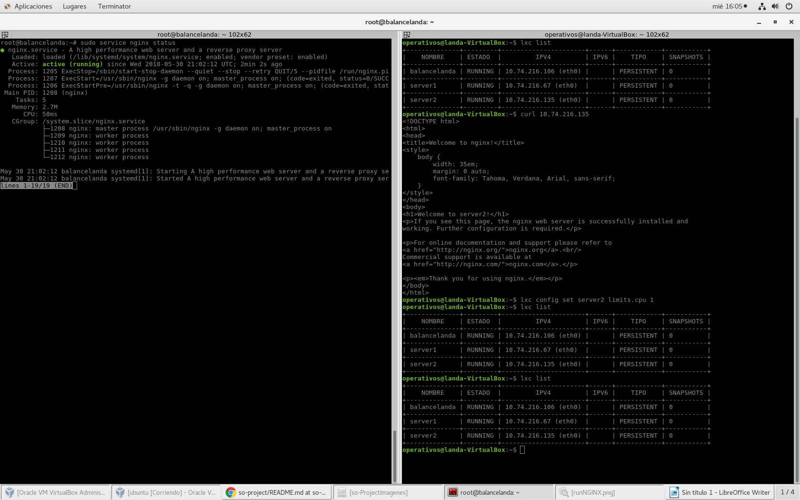

Usando systemctl:  
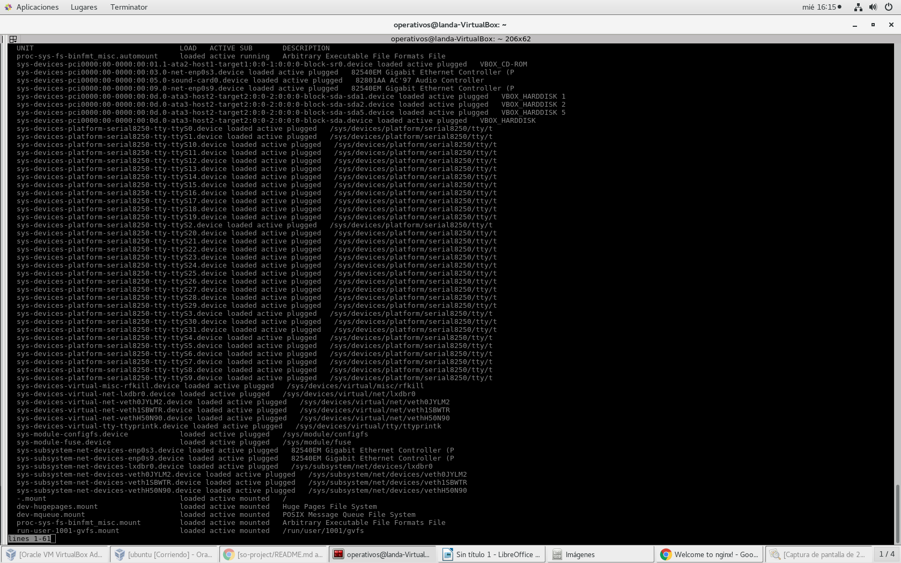


## Pruebas del funcionamiento del balanceador  

Por medio del comando curl se hacen las peticiones a cada uno de los servicios web a través del balanceador, como se puede visualizar en la siguiente imagen:  

Curl server1 y server2:    
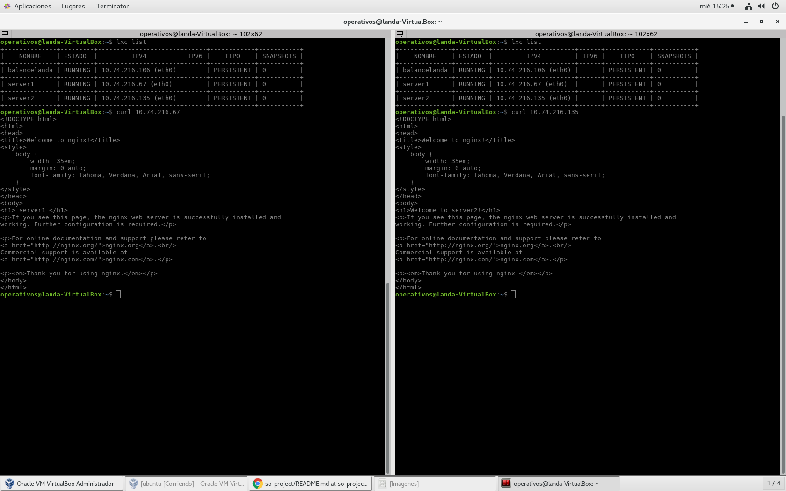    

Curl balanceador de cargas:    
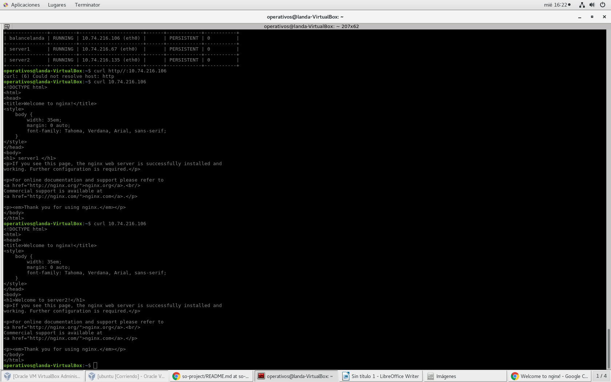  

Para realizar las pruebas de stress utilizamos la herramienta siege, la cual se instala de:  

``` wget http://download.joedog.org/siege/siege-latest.tar.gz ```    

**configuración y pruebas de stress:**  


** Servidores web con 64MB de memoria RAM y CPU 50%**
* Para configurar la memoria RAM de los contenedores web a 64MB y la CPU al 50%, ejecutamos los siguientes  
 comandos:    
```
lxc config set server1 limits.memory 64MB  
lxc config set server2 limits.memory 64MB  
lxc config set server1 limits.cpu.allowance 50%  
lxc config set server2 limits.cpu.allowance 50%  
```  
se muestra el resultado de las pruebas.    
```  
ab -n 1000 -c 100 http://10.225.138.207/  
```
    

``` 
siege -c 100 -t 30s http://10.74.216.106/    
```      
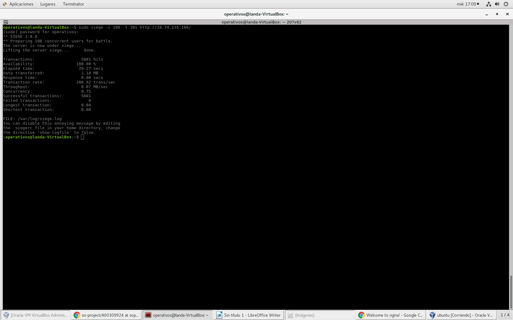    


**Pruebas de estrés servidores web con 128MB de memoria RAM y CPU 100%**  

** Servidores web con 128MB de memoria RAM y CPU 100%**  
* Para configurar la memoria RAM de los contenedores web a 128MB y la CPU al 100%, ejecutamos los siguientes  
 comandos:  

 ```
lxc config set server1 limits.memory 128MB
lxc config set server2 limits.memory 128MB
lxc config set server1 limits.cpu.allowance 100%
lxc config set server2 limits.cpu.allowance 100%
```  
se muestra el resultado de las pruebas.      
```  
ab -n 1000 -c 100 http://10.225.138.207/    
```
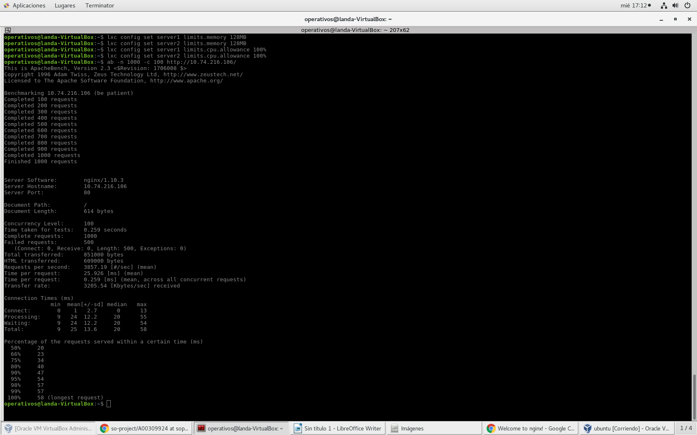      

``` 
siege -c 100 -t 30s http://10.74.216.106/      
```      
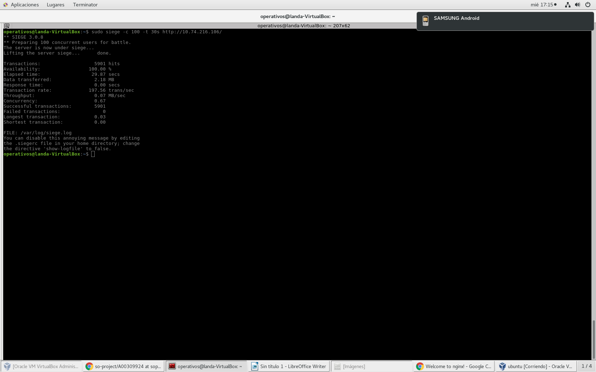      

Acontinuación en la siguiente imagen se pueden evidenciar los cambios correspondientes que se realizaron anteriormente al server1 y server2 para RAM de 64MB y CPU al 50%:  

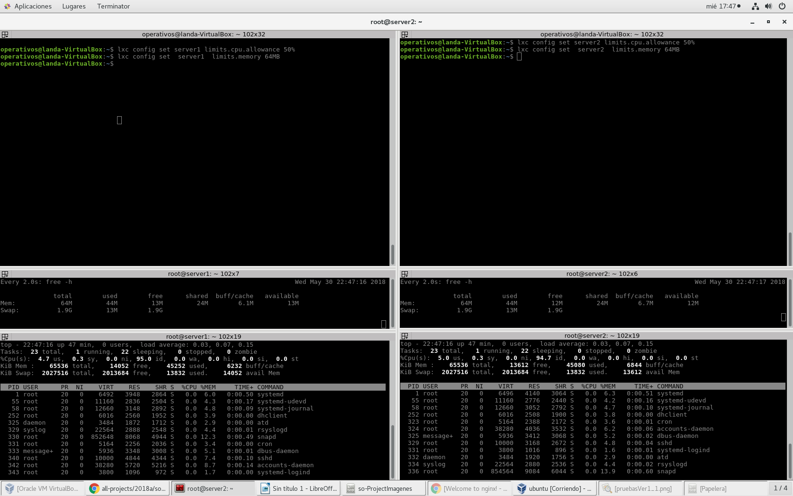  

Acontinuación en la siguiente imagen se pueden evidenciar los cambios correspondientes que se realizaron anteriormente al server1 y server2 para RAM de 128MB y CPU al 100%:  
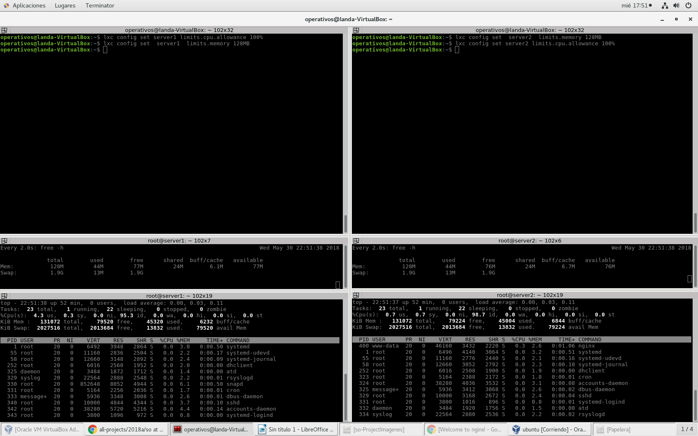  


* Podemos observar que se reduce que la concurrencia y el throughput con el resultado anterior disminuye  

## Configure el reenvio de puertos en la máquina virtual para permitir el acceso desde el sistema anfitrión hacia del contenedor con el servicio para balanceo de carga.

* Para este punto hay que correr los siguientes comandos:

Para declarar la dirección ip pública y la del contenedor que tiene el balanceador de cargas, además de especificar algú puerto:  

```
PORT=80 PUBLIC_IP=192.168.131.80 CONTAINER_IP=10.74.216.106 \
```
Luego se configuran las iptables  

```
sudo iptables -t nat -I PREROUTING -i enp0s9 -p TCP -d $PUBLIC_IP --dport $PORT -j DNAT --to-destination $CONTAINER_IP:$PORT -m comment --comment "forward to the Nginx container"  
```

Por último podemos ingresar a la dirección ip pública, en este caso la: 192.168.131.80:80  

Cada vez que se recargue aparecerá un servidor diferente:  

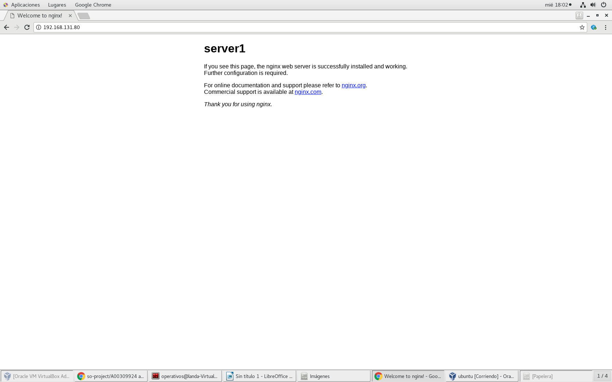  

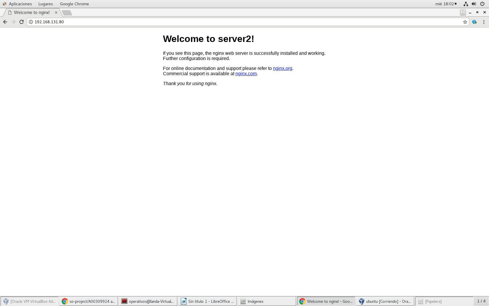

## OPCIONALES


## REFERENCIAS
[1] https://searchservervirtualization.techtarget.com/definition/storage-pools  
[2] http://www.zeta.systems/zetavault/what-is-zfs/


